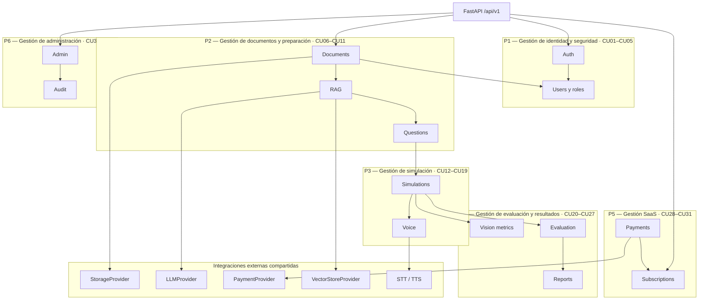

# C4 — Nivel 3: componentes del backend

```mermaid
flowchart TB
  API[FastAPI /api/v1]
  subgraph P1[P1 — Gestión de identidad y seguridad · CU01–CU05]
    Auth[Auth]
    Users[Users y roles]
  end
  subgraph P2[P2 — Gestión de documentos y preparación · CU06–CU11]
    Documents[Documents]
    RAG[RAG]
    Questions[Questions]
  end
  subgraph P3[P3 — Gestión de simulación · CU12–CU19]
    Simulations[Simulations]
    Voice[Voice]
  end
  subgraph P4[P4 — Gestión de evaluación y resultados · CU20–CU27]
    Vision[Vision metrics]
    Evaluation[Evaluation]
    Reports[Reports]
  end
  subgraph P5[P5 — Gestión SaaS · CU28–CU31]
    Subscriptions[Subscriptions]
    Payments[Payments]
  end
  subgraph P6[P6 — Gestión de administración · CU32–CU37]
    Admin[Admin]
    Audit[Audit]
  end

  subgraph Integrations[Integraciones externas compartidas]
    Storage[StorageProvider]
    LLM[LLMProvider]
    PaymentProvider[PaymentProvider]
    VectorDB[VectorStoreProvider]
    Speech[STT / TTS]
  end

  API --> Auth --> Users
  API --> Documents
  Documents --> Users
  Documents --> Storage
  Documents --> RAG --> VectorDB
  RAG --> LLM
  RAG --> Questions --> Simulations
  Simulations --> Voice
  Voice --> Speech
  Simulations --> Vision
  Simulations --> Evaluation --> Reports
  API --> Subscriptions
  Payments --> Subscriptions
  Payments --> PaymentProvider
  API --> Admin
  Admin --> Audit
```
