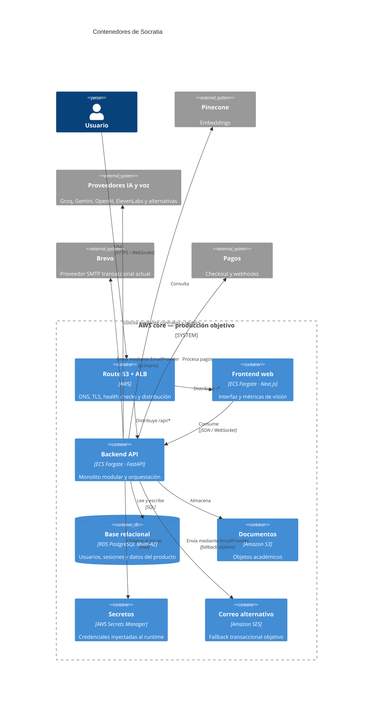

# C4 — Nivel 2: contenedores

```mermaid
C4Container
  title Contenedores de Socratia
  Person(user, "Usuario")
  System_Boundary(aws, "AWS core — producción objetivo") {
    Container(edge, "Route 53 + ALB", "AWS", "DNS, TLS, health checks y distribución")
    Container(web, "Frontend web", "ECS Fargate · Next.js", "Interfaz y métricas de visión")
    Container(api, "Backend API", "ECS Fargate · FastAPI", "Monolito modular y orquestación")
    ContainerDb(db, "Base relacional", "RDS PostgreSQL Multi-AZ", "Usuarios, sesiones y datos del producto")
    Container(s3, "Documentos", "Amazon S3", "Objetos académicos")
    Container(secrets, "Secretos", "AWS Secrets Manager", "Credenciales inyectadas al runtime")
    Container(ses, "Correo alternativo", "Amazon SES", "Fallback transaccional objetivo")
  }
  System_Ext(vector, "Pinecone", "Embeddings")
  System_Ext(ai, "Proveedores IA y voz", "Groq, Gemini, OpenAI, ElevenLabs y alternativas")
  System_Ext(email, "Brevo", "Proveedor SMTP transaccional actual")
  System_Ext(payment, "Pagos", "Checkout y webhooks")

  Rel(user, edge, "Usa", "HTTPS / WebSocket")
  Rel(edge, web, "Distribuye /*")
  Rel(edge, api, "Distribuye /api/*")
  Rel(web, api, "Consume", "JSON / WebSocket")
  Rel(api, db, "Lee y escribe", "SQL")
  Rel(api, s3, "Almacena")
  Rel(api, secrets, "Obtiene al iniciar", "IAM")
  Rel(api, vector, "Consulta")
  Rel(api, ai, "Solicita mediante contratos y routers")
  Rel(api, email, "Envía mediante EmailProvider", "primario")
  Rel(api, ses, "Envía mediante EmailProvider", "fallback objetivo")
  Rel(api, payment, "Procesa pagos")
```
