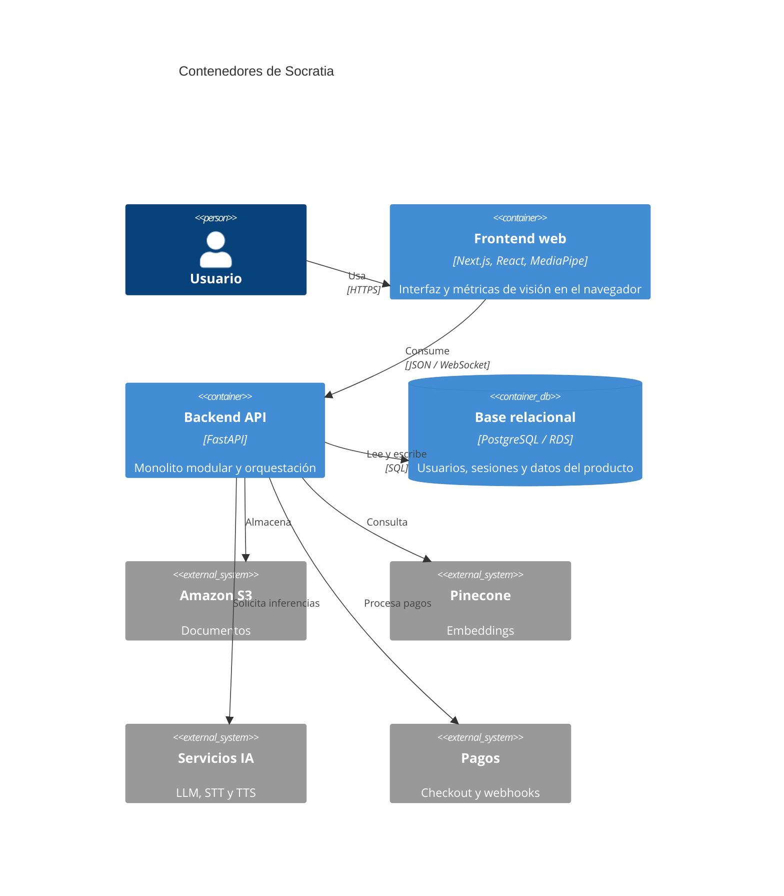

# C4 — Nivel 2: contenedores

```mermaid
C4Container
  title Contenedores de Socratia
  Person(user, "Usuario")
  Container(web, "Frontend web", "Next.js, React, MediaPipe", "Interfaz y métricas de visión en el navegador")
  Container(api, "Backend API", "FastAPI", "Monolito modular y orquestación")
  ContainerDb(db, "Base relacional", "PostgreSQL / RDS", "Usuarios, sesiones y datos del producto")
  System_Ext(s3, "Amazon S3", "Documentos")
  System_Ext(vector, "Pinecone", "Embeddings")
  System_Ext(ai, "Servicios IA", "LLM, STT y TTS")
  System_Ext(payment, "Pagos", "Checkout y webhooks")

  Rel(user, web, "Usa", "HTTPS")
  Rel(web, api, "Consume", "JSON / WebSocket")
  Rel(api, db, "Lee y escribe", "SQL")
  Rel(api, s3, "Almacena")
  Rel(api, vector, "Consulta")
  Rel(api, ai, "Solicita inferencias")
  Rel(api, payment, "Procesa pagos")
```

