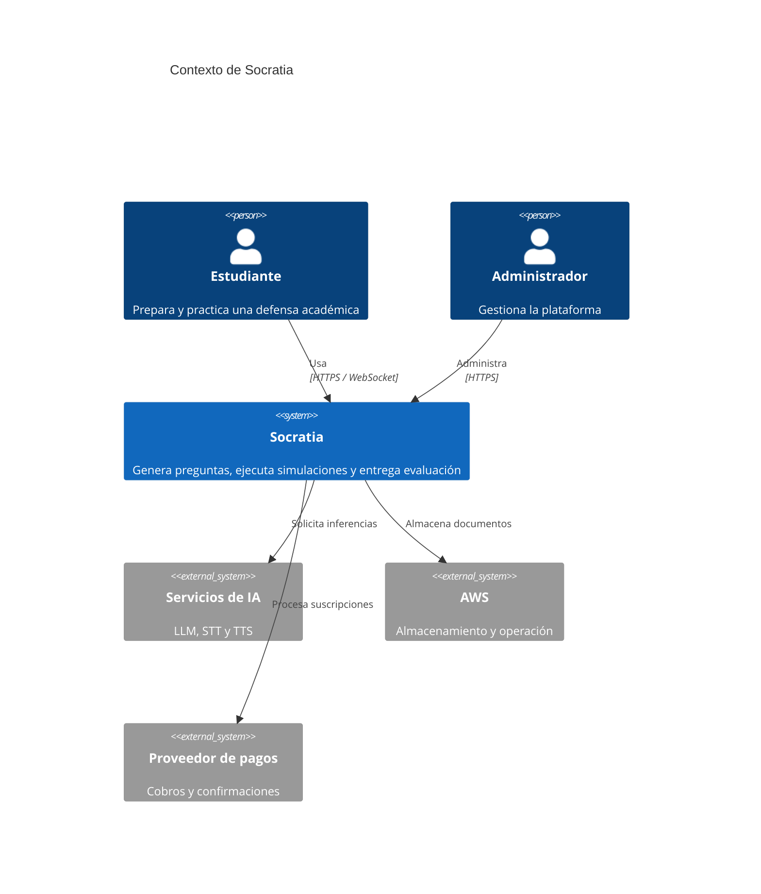

# C4 — Nivel 1: contexto

```mermaid
C4Context
  title Contexto de Socratia
  Person(student, "Estudiante", "Prepara y practica una defensa académica")
  Person(admin, "Administrador", "Gestiona la plataforma")
  System(socratia, "Socratia", "Genera preguntas, ejecuta simulaciones y entrega evaluación")
  System_Ext(ai, "Servicios de IA", "LLM, STT y TTS")
  System_Ext(aws, "AWS", "Almacenamiento y operación")
  System_Ext(payments, "Proveedor de pagos", "Cobros y confirmaciones")

  Rel(student, socratia, "Usa", "HTTPS / WebSocket")
  Rel(admin, socratia, "Administra", "HTTPS")
  Rel(socratia, ai, "Solicita inferencias")
  Rel(socratia, aws, "Almacena documentos")
  Rel(socratia, payments, "Procesa suscripciones")
```

